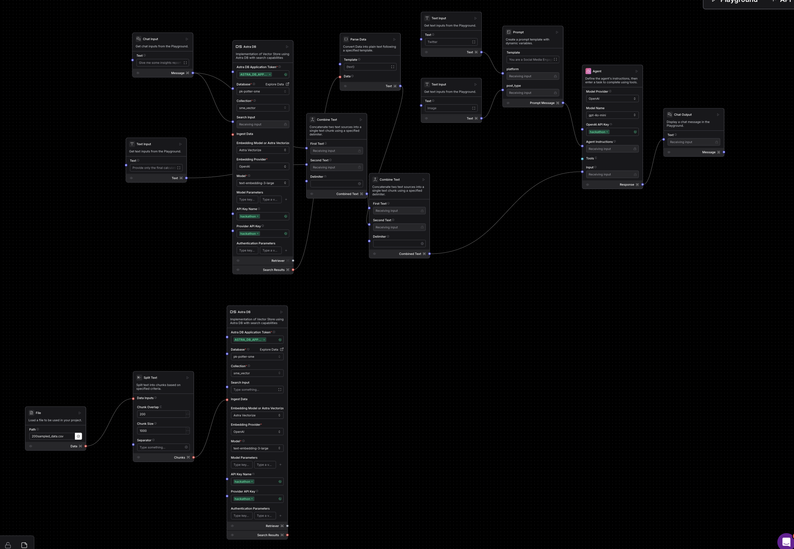
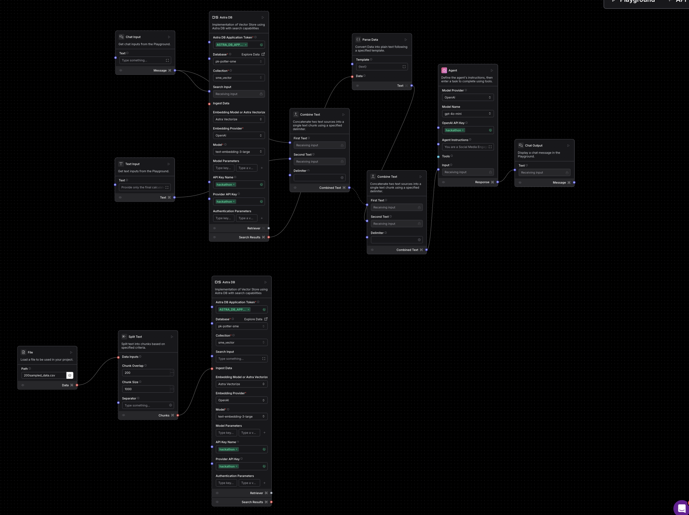

# Project: GenAI-based Report Generation & Chatbot using LangFlow and AstraDB

## Overview

This project integrates **LangFlow** with **AstraDB** (a vector database) to enable **Report Generation** and **Chatbot Interactions** using GenAI. The project consists of two main workflows:
1. **Report Generation using GenAI**
2. **GenAI Chatbot**

Both workflows involve ingesting data, processing it using LangFlow modules, querying AstraDB, and providing insights or reports based on user inputs.

---

## Workflows

### 1. Report Generation using GenAI Flow

#### **Data Ingestion**

1. **CSV Loader**: The process starts by loading data from a `.csv` file. This data is then processed in the following steps:
   
2. **Split Text**: The text is split into chunks to manage the data. A chunk overlap of 200 is used, with each chunk having a size of 1000.

3. **AstraDB Data Ingestion**: Using LangFlow's AstraDB flow module, the ingested data is stored and processed within AstraDB for efficient querying.

#### **Report Generation**

Once the data is ingested, the following inputs are gathered:

1. **Chat Input** (Default: “Generate Report”): A basic user input, which acts as the initial command.
   
2. **Text Input 1** (Default: “Provide only final Calculations”): This is an input for querying AstraDB to fetch specific insights.
   
3. **Text Input 2** (User Input): A prompt template that represents the **Platform** of the post, entered by the user via Streamlit UI.
   
4. **Text Input 3** (User Input): Another prompt template for the **Post Type** of the post, also entered via Streamlit UI.

#### **Flow Execution**:
1. **Text Combination**: The **Chat Input** and **Text Input 1** are combined to create a query.
   
2. **AstraDB Search**: The data from AstraDB search results is converted into text with a `{text}` placeholder.

3. **Agent Input**: The combined query and AstraDB search results are fed as input to the **GenAI Agent**.

4. **System Prompt for Agent**:
“You are a Social Media Engagement Report Assistant. Your job is to analyze all data and provide a summary of insights – REPORT as bullet points strictly based on the information requested from the data.
Provide insights as the following below, AS PER THE QUERY from the data:
Compare with the same post type and platform.
Compare with the other post types in the same platform from the data provided.
Compare with the other post types in the other platform from the data provided.
DO NOT PROVIDE POST DATA LIKE POST_ID, etc. JUST PROVIDE REPORT. ONLY PROVIDE REPORT AS BULLET POINT SUMMARIES.
Start outputs with the following: "Based on the data provided, Here are the insights"
GENERATE THE OUTPUTS AS PER THE QUERY.
If the answer to a query cannot be determined from the given data, respond with 'I don’t know'. Always use the data in the table to calculate metrics and provide insights, even for custom queries. DO NOT MAKE ASSUMPTIONS.
Platform: {platform} Post_Type: {post_type}”

5. **Final Output**: The output generated by the agent is displayed as the **Report** in the Streamlit UI.

---

### 2. GenAI Chatbot Flow

#### **Data Ingestion**

1. **CSV Loader**: Similar to the report generation workflow, the data is loaded from a `.csv` file.

2. **Split Text**: The data is split into chunks with an overlap of 200 and chunk size of 1000.

3. **AstraDB Data Ingestion**: The data is ingested into AstraDB using LangFlow's AstraDB flow module for efficient retrieval.

#### **Chatbot Interaction**

Once the data is ingested, the following inputs are required:

1. **Chat Input** (Provided by the User via Streamlit UI): A direct query or question the user asks the chatbot.

2. **Text Input 1** (Default: “Provide only final Calculations”): A query parameter for AstraDB search input to fetch relevant data.

#### **Flow Execution**:
1. **Text Combination**: The **Chat Input** and **Text Input 1** are combined into a single query.

2. **AstraDB Search**: Data fetched from AstraDB search results is converted into text with the `{text}` placeholder.

3. **Agent Input**: The combined user input and AstraDB data are passed to the **GenAI Agent**.

4. **System Prompt for Agent**:
“You are a Social Media Engagement Chat Assistant. Your job is to analyze all data and provide a response strictly based on the information requested from the data.
Provide insights AS PER THE QUERY from the data.
DO NOT PROVIDE POST DATA LIKE POST_ID, etc. JUST PROVIDE REPORT. ONLY PROVIDE AS SUMMARIES.
Start outputs with the following: "Based on the data provided, Here are the insights"
GENERATE THE OUTPUTS AS PER THE QUERY.
If the answer to a query cannot be determined from the given data, respond with 'I don’t know'. Always use the data in the table to calculate metrics and provide insights, even for custom queries. DO NOT MAKE ASSUMPTIONS.”

5. **Final Output**: The chatbot’s response is displayed in the **Chatbot Response** section of the Streamlit UI.
